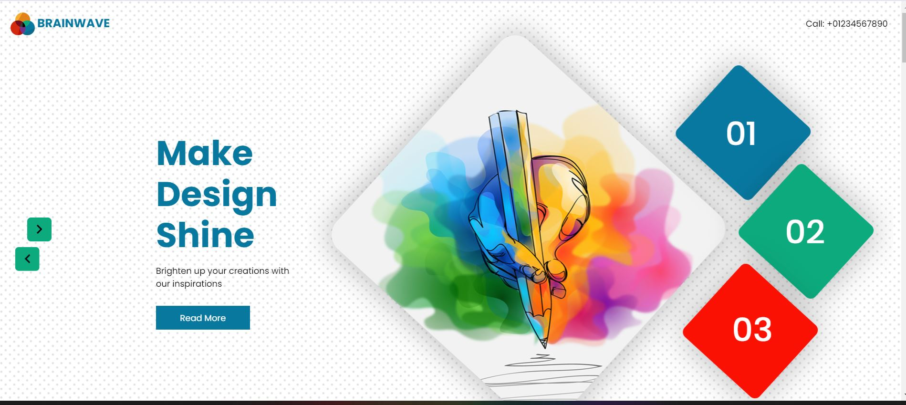
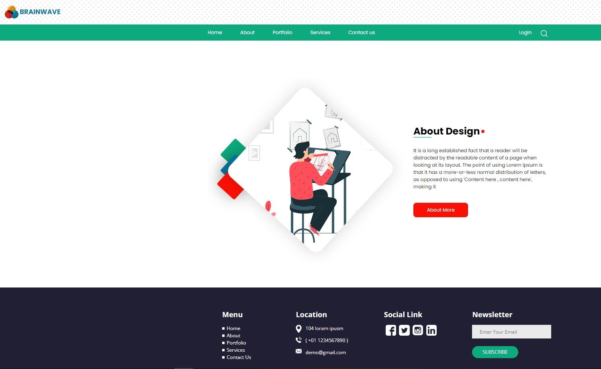
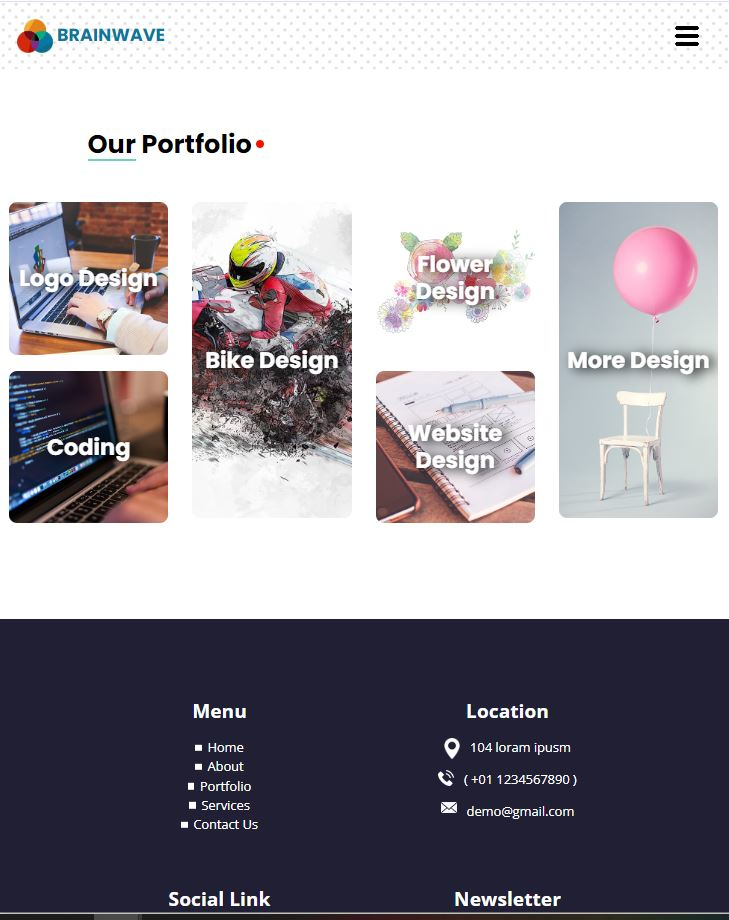
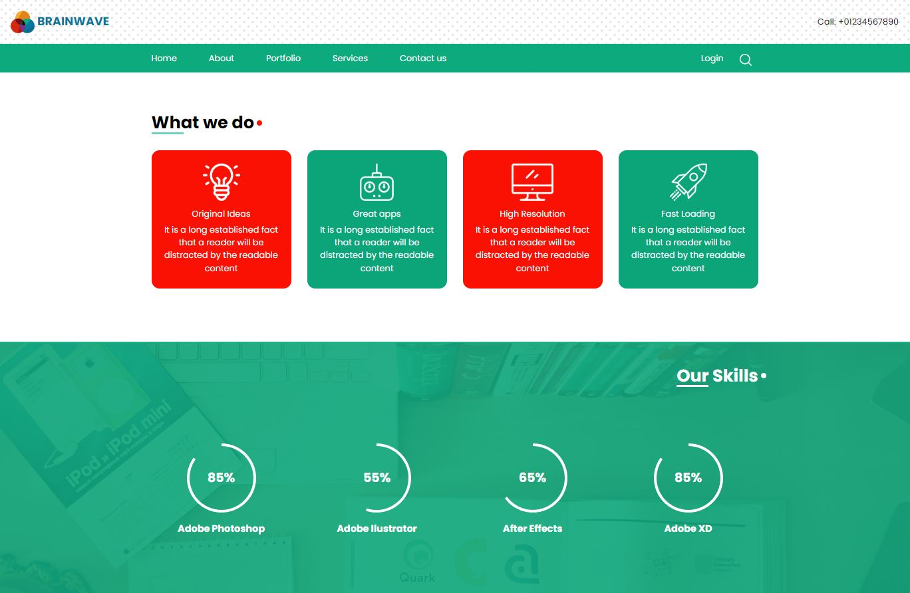

# dynamic-site-with-flask
This exercise was done for learning purposes.  
My goal was to play with Flask server and improve my html css skills 
 
I took a free 100% static site template and decides to convert it into a dynamic site 
 
First, pages was splitted in 3 templates (header/body/footer) then converted in jinja2 format and used to rebuild the html pages dynamically.  
Content like headers are managed from back-end to front-end  and contact form   is an exemple on how to  pass data from front-end to back-end   
 
<i>Note: The working contact form is the one used by  page contact.html, not the one at the end of the index page) </i>
 

  

 

 

